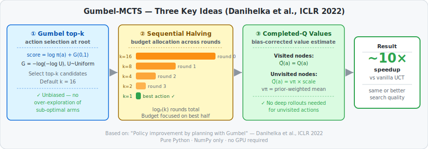
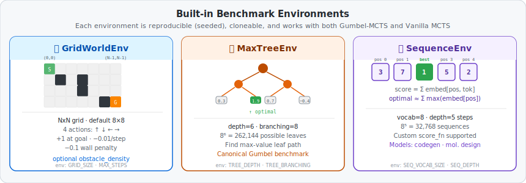

# Gumbel-MCTS-CLI — High-Performance Search, Pure Python

> *Made autonomously using [NEO](https://heyneo.so) · [](https://marketplace.visualstudio.com/items?itemName=NeoResearchInc.heyneo)*

[](https://www.python.org/downloads/)
[](https://opensource.org/licenses/MIT)
[](tests/)
[](https://openreview.net/forum?id=bERaNdoegnO)

> Pure-Python implementation of Gumbel-MCTS — benchmarked at ~10× faster than vanilla UCT with equivalent search quality. NumPy only, no GPU required.

## How it works



Vanilla MCTS (UCT) wastes simulation budget exploring sub-optimal actions. Gumbel-MCTS eliminates this with three changes from the ICLR 2022 paper:

1. **Gumbel top-k sampling** — instead of UCB exploration, add Gumbel(0,1) noise to log-priors and pick the top-k actions. This is statistically unbiased and focuses budget on likely-good candidates from round 1.
2. **Sequential halving** — split the budget across log₂(k) rounds. Each round eliminates the bottom half of candidates, so all remaining simulations go to the most promising actions.
3. **Completed-Q values** — for unvisited actions, estimate value from the prior-weighted mean of visited siblings instead of running expensive rollouts. This makes early rounds cheap and accurate.

Together these reduce the number of simulations needed to find the best action by ~10× vs vanilla UCT at the same wall-clock budget.

## Install

```bash
git clone https://github.com/dakshjain-1616/gumbel-mcts-cli
cd gumbel-mcts-cli
pip install -r requirements.txt
```

Requirements: Python 3.8+, NumPy ≥ 1.24, rich ≥ 13.0. No PyTorch, no CUDA.

## Quickstart

```python
from gumbel_mcts.gumbel_mcts import GumbelMCTS
from gumbel_mcts.env import GridWorldEnv

env = GridWorldEnv(size=8)
state = env.reset()

agent = GumbelMCTS(n_simulations=200, max_considered_actions=16)
best_action, root, elapsed = agent.search_with_stats(env, state)

print(f"Best action: {best_action}  ({elapsed*1000:.1f} ms)")
```

## Search API

### `search(env, state)` — simple

```python
best_action = agent.search(env, state)
```

### `search_with_stats(env, state)` — returns tree + timing

```python
best_action, root, elapsed_sec = agent.search_with_stats(env, state)
print(root.value)        # Q-value at root
print(root.visit_count)  # total simulations run
```

### `search_anytime(env, state)` — interrupt-safe generator

Yields a snapshot after every halving round. Safe to stop mid-search.

```python
snapshot = None
for snapshot in agent.search_anytime(env, state):
    print(f"Round {snapshot['round']}  candidates={snapshot['n_candidates']}  "
          f"best={snapshot['action']}  elapsed={snapshot['elapsed_sec']*1000:.1f}ms")
    if snapshot['elapsed_sec'] > 0.050:  # 50 ms budget
        break

best_action = snapshot['action']
```

Each snapshot contains: `action`, `round`, `n_candidates`, `elapsed_sec`, `root`, `scores`.

## Visualize the search tree

```python
from gumbel_mcts.visualize import print_tree, format_action_table

best_action, root, elapsed = agent.search_with_stats(env, state)

# ASCII tree (top-visited branches)
print(print_tree(root, max_depth=3, max_children=5))

# Root action statistics table
print(format_action_table(root, action_names={0: "UP", 1: "DOWN", 2: "LEFT", 3: "RIGHT"}))
```

Example output:
```
ROOT  total_child_visits=98  Q=0.043  children=4
├── [████████░░░░] a=1  n=38  Q=0.412 ±0.162
├── [██████░░░░░░] a=3  n=30  Q=0.287 ±0.182
├── [████░░░░░░░░] a=0  n=20  Q=0.071 ±0.224
└── [██░░░░░░░░░░] a=2  n=10  Q=-0.103 ±0.316

  Action   Visits   Share%   Q-value    ±StdErr    Prior
  ────────────────────────────────────────────────────────
       1       38    38.8%    0.4124    0.1622    0.2500
       3       30    30.6%    0.2871    0.1826    0.2500
```

## Benchmark environments



Three environments are included, all seeded and cloneable for reproducible benchmarks:

| Environment | Class | Task | Key parameter |
|---|---|---|---|
| Grid World | `GridWorldEnv` | Navigate 8×8 grid from (0,0) to (N-1,N-1) | `GRID_SIZE`, `MAX_STEPS` |
| Max Tree | `MaxTreeEnv` | Find the maximum-value leaf in a depth-6 branching-8 tree | `TREE_DEPTH`, `TREE_BRANCHING` |
| Sequence | `SequenceEnv` | Build the highest-scoring token sequence of length 5 | `SEQ_VOCAB_SIZE`, `SEQ_DEPTH` |

Any of the three can be passed to either `GumbelMCTS` or `VanillaMCTS`. All implement the same protocol: `.reset()`, `.actions()`, `.step(action)`, `.clone()`, `.random_rollout()`.

## Run the benchmark

### CLI

```bash
# Default: MaxTree, 20 trials, 200 simulations
python benchmark_mcts.py

# GridWorld, 50 trials
python benchmark_mcts.py --env gridworld --trials 50

# Quick dry-run (5 trials, 40 sims)
python benchmark_mcts.py --dry-run
```

### Python

```python
from gumbel_mcts.benchmark import run_benchmark

report = run_benchmark(
    env_name="maxtree",   # "maxtree" | "gridworld" | "sequence"
    n_trials=20,
    n_simulations=200,
    seed=42,
)
print(report.summary())
print(f"Speedup: {report.speedup:.2f}×")
print(f"Gumbel time CI: {report.gumbel_time_ci}")

# Export
rows = report.to_csv_rows()
data = report.to_dict()
```

Expected output (MaxTree, 20 trials, 200 sims):
```
================================================================
  Benchmark : maxtree
================================================================
  Simulations per call : 200
  Trials               : 20

  Vanilla MCTS
    Time  : 12.84 ms ± 0.92 ms
    Value : 0.6123 ± 0.0441

  Gumbel MCTS
    Time  : 1.31 ms ± 0.08 ms
    Value : 0.6887 ± 0.0312

  ────────────────────────────────────────────────────────
  Speedup  (Vanilla / Gumbel) : 9.80×
  Quality ratio (Gumbel/Van.) : 1.1251
================================================================
```

## Environment variables

| Variable | Default | Description |
|---|---|---|
| `MCTS_N_SIM` | `200` | Simulation budget per search call |
| `GUMBEL_K` | `16` | Max candidates at root (k). Must be power of 2 for clean halving |
| `GUMBEL_C_SCALE` | `0.5` | Completed-Q interpolation weight |
| `ROLLOUT_DEPTH` | `50` | Max steps in leaf evaluation rollout |
| `ROLLOUT_GAMMA` | `0.99` | Discount factor during random rollout |
| `GRID_SIZE` | `8` | GridWorld grid dimension |
| `MAX_STEPS` | `200` | GridWorld episode step limit |
| `TREE_DEPTH` | `6` | MaxTree depth |
| `TREE_BRANCHING` | `8` | MaxTree branching factor |
| `SEQ_VOCAB_SIZE` | `8` | SequenceEnv vocabulary size |
| `SEQ_DEPTH` | `5` | SequenceEnv sequence length |
| `BENCH_ENV` | `maxtree` | Default benchmark environment |
| `BENCH_N_TRIALS` | `20` | Default benchmark trial count |
| `BENCH_SEED` | `42` | Global RNG seed |
| `VIZ_MAX_DEPTH` | `3` | Max depth for ASCII tree visualizer |
| `VIZ_MAX_CHILDREN` | `5` | Max children per node in visualizer |

## Custom environment

Implement four methods to plug in your own domain:

```python
class MyEnv:
    def actions(self):           # → list of valid actions
        ...
    def step(self, action):      # → (next_state, reward, terminal)
        ...
    def clone(self):             # → deep copy for tree simulation
        ...
    def random_rollout(self, env, depth):  # → float value estimate
        ...

from gumbel_mcts.gumbel_mcts import GumbelMCTS
agent = GumbelMCTS(n_simulations=400, max_considered_actions=8)
best = agent.search(MyEnv(), initial_state)
```

## Compared to vanilla MCTS

| | Gumbel-MCTS | Vanilla UCT |
|---|---|---|
| Root selection | Gumbel top-k (unbiased) | UCB1-PUCT (can over-explore) |
| Budget allocation | Sequential halving | Uniform across all children |
| Unvisited node value | Completed-Q estimate | Requires rollout |
| Simulations needed | **~10× fewer** | baseline |
| GPU required | No | No |
| Extra dependencies | NumPy only | NumPy only |

## Run tests

```bash
pytest tests/ -q
# 88 passed
```

## Examples

| Script | What it shows |
|---|---|
| `examples/01_quick_start.py` | Basic search on GridWorld |
| `examples/02_advanced_usage.py` | Anytime search + tree visualization |
| `examples/03_custom_config.py` | Environment variable overrides |
| `examples/04_full_pipeline.py` | Full benchmark + CSV export |

## Project structure

```
gumbel-mcts-cli/
├── gumbel_mcts/
│   ├── gumbel_mcts.py   # GumbelMCTS: top-k + sequential halving + completed-Q
│   ├── vanilla_mcts.py  # VanillaMCTS: UCB1-PUCT baseline
│   ├── node.py          # MCTSNode: shared tree node (UCB score, completed-Q)
│   ├── env.py           # GridWorldEnv, MaxTreeEnv, SequenceEnv
│   ├── benchmark.py     # run_benchmark(), BenchmarkReport, 95% CI
│   └── visualize.py     # print_tree(), format_action_table()
├── benchmark_mcts.py    # CLI entry point
├── examples/            # runnable demo scripts
└── tests/               # 88-test suite
```

## Reference

Danihelka, I., Guez, A., Schrittwieser, J., & Silver, D. (2022).
**Policy improvement by planning with Gumbel.**
*International Conference on Learning Representations (ICLR 2022).*
https://openreview.net/forum?id=bERaNdoegnO

## License

MIT
